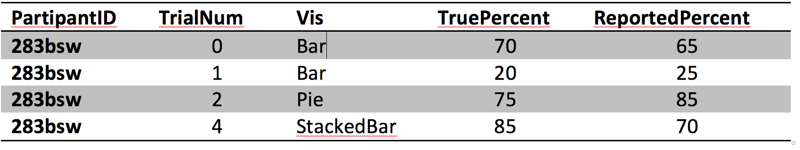

Assignment 3 - Replicating a Classic Experiment  
===

Q: How do we know that bar charts are better than pie charts?  
A: Controlled experiments!

In this assignment you'll implement a simple controlled experiment using some of the visualizations you’ve been building this semester. 
You'll need to develop support code for the experiment sequence, results file output, and other experiment components. 
(These are all very simple with Javascript buttons and forms.)
The main goals for you are to a) test three competing visualizations, b) implement data generation and error calculation functions from Cleveland and McGill's 1984 paper, c) run the experiment with 10 participants, and d) do some basic analysis and reporting of the results.

For this assignment you should write everything from scratch -- except for charts you've made in previous assignments.
You may *reference* demo programs from books or the web, and if you do please provide a References section with links at the end of your Readme.

Teams
---

You can have choose to have (1) teammate.
If you choose to do so, add a **Collaboration** section with a single paragraph per teammate describing what aspects each of you contributed to the most.

Requirements
---

- Look it over Cleveland and McGill's original experiment (see the section below) and [watch this video](experiment-example.mp4) to get a sense of the experiment structure and where your visualizations will go.
- When viewing the example experiment video, note the following:
    - Trials are in random order.  
    - Each trial has a randomly generated set of 10 data points.  
    - Two of these data points are marked.  
- Implement the data generation code **as described in the Cleveland & McGill paper**. 
    - The goal is to generate 10 random datapoints (values should be between 0 and 100) and to mark two of them for comparison in the trial. 
- Add 3 of your (hopefully) existing visualizations to the experiment. When you are adding these visualizations, think about *why* these visualizations are interesting to test. In other words, keep in mind a *testable hypothesis* for each of the added visualization. Some good options include your bar charts, pie charts, stacked-bar charts, and treemaps. You can also rotate your bar chart to be horizontal or upside-down as one of your visualizations. You are encouraged to test unorthodox charts -- radar charts come to mind as something that has never been tested.
    - Follow the style from Cleveland and McGill closely (i.e. no color) unless you are specifically testing a hypothesis (i.e. color versus no color). Pay attention to spacing between bars. Do not mark bars for comparison using color-- this makes the perceptual task too easy.
- After each trial, implement code that grades and stores participant’s responses.
- At the end of the experiment, use Javascript to show the data from the current experiment\* (i.e. a comma separated list in a text box) and copy it into your master datafile. See the Background section below for an example of what this file should look like. (\*Alternately implement a server, if you're experienced with that sort of thing.)

- Figure out how to calculate "Error", the difference between the true percentage and the reported percentage.
- Scale this error using Cleveland and McGill’s log-base-2 error. For details, see the background section (there’s a figure with the equation). This becomes your “Error” column in the output. Make sure you use whole percentages (not decimal) in the log-base-2 equation. Make sure you handle the case of when a person gets the exact percentage correct (log-base-2 of 1/8 is -3, it is better to set this to 0).
- Run your experiment with 10 or more participants.  
    - Grab your friends or people in the class.  
    - Run at least 20 trials per visualization type. If you have 3 visualizations, run at least 60 random trials.
- Bonus: if you implement a [Latin Square design](http://en.wikipedia.org/wiki/Latin_square) to ensure that the 60 trials are counterbalanced, we’ll give you a bonus.
- Make sure to save the resulting CSV after each participant. Compile the results into a master csv file (all participants, all trials).
- Produce a README with figures that shows the visualizations you tested and results, ordered by best performance to worst performance.
- To obtain the ranking, calculate and report the average Error for each visualization across all trials and participants. This should be straightforward to do in a spreadsheet.
- Use Bootstrapped 95\% confidence intervals for your error upper and lower bounds. Include these in your figures. Bootstrapped confidence intervals are easily implemented in R. 
- Include example images of each visualization as they appeared in your experiment (i.e. if you used a pie chart show the actual pie chart you used in the experiment along with the markings, not an example from Google Images).

## General Requirements

0. Your code should be forked from the GitHub repo and linked using GitHub pages.
2. Your project should use d3 to build visualizations. 
3. Your writeup (readme.md in the repo) should contain the following:

- Working link to the experiment hosted on gh-pages.
- Concise description and screenshot of your experiment.
- Description of the technical achievements you attempted with this project.
- Description of the design achievements you attempted with this project.

Background
---

In 1984, William Cleveland and Robert McGill published the results of several controlled experiments that pitted bar charts against pies and stacked-bar variants. 
Their paper (http://www.cs.ubc.ca/~tmm/courses/cpsc533c-04-spr/readings/cleveland.pdf) is considered a seminal paper in data visualization.
In particular, they ran a psychology-style experiment where users were shown a series of randomly-generated charts with two graphical elements marked like this:

Participants were then asked, "What percentage is the smaller of the larger?". 
This was repeated hundreds of time with varying data and charts. 
By the end of the study, Cleveland and McGill had amassed a large dataset that looked like this:

__Log-base-2 or "cm-error"__: The true percent is the actual percentage of the smaller to the larger, while the reported percent is what participants reported. 
Cleveland and McGill recognized that their analyses would be biased if they took `abs(ReportedPercent – TruePercent)` as their score for error. 
To compensate, they came up with a logarithmic scale for error with this equation:

You’ll be implementing this error score as part of the lab. 
(Hint: it’s not a trick question, this is just to familiarize you with the experiment protocol). 
With this Cleveland-McGill error score you can better compare the performance of the charts you test to figure out which one performs the best.

As a baseline, compare your average Error scores to the following chart, which include both Cleveland and McGill’s results as well as more recent extensions of this experiment (lower error indicates better performance, and error bars are bootstrapped 95% confidence intervals (`http://en.wikipedia.org/wiki/Confidence_interval#Meaning_and_interpretation`)):

GitHub Details
---

- Fork the GitHub Repository. You now have a copy associated with your username.
- Make changes to index.html to fulfill the project requirements. 
- Make sure your "master" branch matches your "gh-pages" branch. See the GitHub Guides referenced above if you need help.
- Edit the README.md with a link to your gh-pages site: http://YourUsernameGoesHere.github.io/05-Experiment/index.html
- To submit, make a [Pull Request](https://help.github.com/articles/using-pull-requests/) on the original repository.

Grading
---

Grades on a 100 point scale 100 points will be graded for functionality: the program does what the assignment requests. 

I will use Google Chrome to view submissions. Be sure to test your code there.

Total -- 100

(0 will be assigned if the code won't run.)

Functionality -- 80

80 -- Experiment loads and works with no obvious bugs or design flaws; Experiment results reported with no obvious flaws (i.e. too few participants, data suspiciously different than original results with no explanation as to why it differs, etcetera) 

Writeup -- 20

10 -- Description of technical achievements    
10 -- Description of design achievements  
